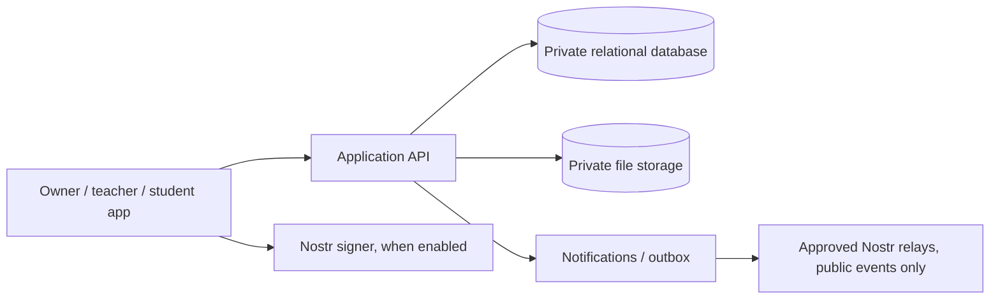

# Implementation plan

Status: proposed, September 2026. This is a plan, not a record of implemented features.

## Architecture boundary

Use an application API and access-controlled database as the source of truth for academy operations. Store uploaded files in private object storage behind authorized downloads. Use Nostr for identity and selected publication only after the private workflow works. The [data model](data-model.md) and [Nostr event strategy](nostr-events.md) specify those boundaries.

## Documentation map

| Document | Question it answers |
| --- | --- |
| [School system design](../school-system.md) | What can each role do, and what is the school workflow? |
| [User flows](../user-flows.md) | What steps does each role take, including alternate and failure paths? |
| [Data model](data-model.md) | What records exist, and which constraints protect them? |
| [Nostr event strategy](nostr-events.md) | Which NIPs and event kinds apply, and what stays private? |
| [Prototype test guide](../idea-prototype.md) | How should a later prototype be tested with users? |

The older `idea.md` and `chat.md` files remain concept sketches. Review them against these documents before building a screen.

## Delivery slices

| Slice | Deliverable | Acceptance check |
| --- | --- | --- |
| 1. Identity and academy | Sign-in, academy membership, roles, term and subject setup | A user cannot read another academy's records; role grants and revocations are audited |
| 2. Classes and enrollment | Publish class, assign teacher, invite and enroll students | A student sees only active classes; a teacher sees only assigned classes |
| 3. Homework | Publish to whole class or selected students; private file upload; student submits versions | Unselected students cannot discover the task or download its files; resubmission preserves history |
| 4. Grading | Review queue, revision request, rubric and test score, gradebook | Corrected grades retain prior values; missing and excused differ from zero; totals follow a versioned policy |
| 5. Completion | Eligibility calculation and teacher recommendation | Rules are visible; recommendation does not grant signing authority |
| 6. Nostr identity pilot | Optional signer login/linking, NIP-05, public academy profile | Signatures and identifiers are checked; no coursework or roster data reaches a public relay |
| 7. Credential pilot | Separate issuer approval, signed artifact, sharing, status and verification | Verifier checks signature, issuer authority, recipient/subject, and current status |

Ship slices 1–4 as a useful school product. Slices 5–7 need policy and trust decisions before real credential issuance.

## Work inside each slice

1. Define API commands and authorization checks before UI actions. Use the academy ID and class membership resolved server-side; never trust a client-supplied role.
2. Add database migrations with foreign keys, uniqueness, and state transition rules. Use transactions for publish, enroll, finalize grade, and approve completion.
3. Write focused tests for access boundaries, duplicate commands, grade calculations, and version history.
4. Build owner, teacher, and student screens from the same state names and error codes.
5. Add audit records and transactional outbox entries in the same transaction as each state change; workers deliver notifications after commit.
6. Test with fictional records before importing any real student data.

## Decisions required before coding affected slices

| Decision | Recommended starting choice |
| --- | --- |
| Academy creation | Verified school or college onboarding before credentials; manual platform approval for pilot |
| Enrollment | Owner approval, with teacher requests allowed later |
| Grading | Academy-selected scale and weights, versioned per class |
| Late and catch-up work | Policy visible on each class and assignment; explicit exceptions recorded |
| Minors and retention | Do not onboard minors until age, guardian, retention, and jurisdiction rules are defined |
| Identity | App account first; optional linked Nostr pubkey, never a required key for a student in the first release |
| Credentials | Choose a formal credential format and verifier contract before signing real awards |
| Relay publication | Explicit allowlist of public event types and fields; no private coursework |

## Exit criteria for the first release

An owner can create and staff a class; a student can enroll and submit homework; a teacher can request revision and finalize a grade; the student sees only their own result; another student cannot access the submission through UI, API, file URL, search, or notifications. An academic staff member can explain the grade calculation and audit history.
