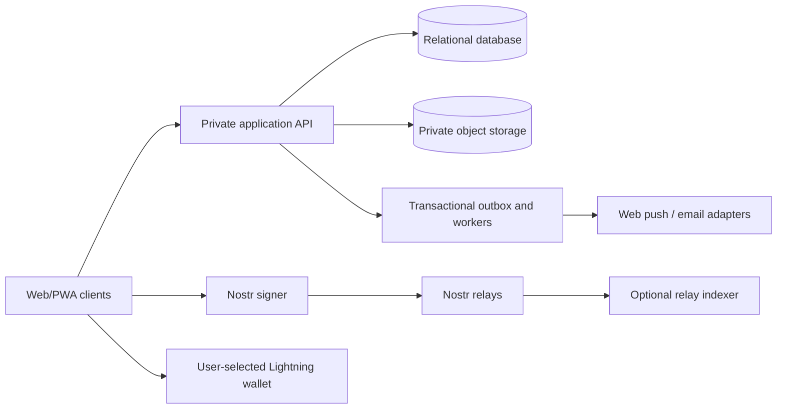

# Product roadmap: education, social, messaging, notifications, and payments

Status: recommended product and engineering plan, October 2026. This document extends the
[school system design](school-system.md); it does not replace that product contract. Check
[build progress](architecture/progress.md) before treating any item here as implemented.

## Product direction

BitOS Education should be a trustworthy learning network, not a general social client with school
features attached. The education workflow is the core: join a class, learn, submit, receive
feedback, complete a course, and own a verifiable result. Nostr adds portable identity, public
discovery, user-controlled communication, and optional payments.

The recommended product has three connected planes:

1. **School plane:** private classes, rosters, assignments, submissions, grades, policies, and
   audit history. The private API and durable database are authoritative by default.
2. **Social plane:** public profiles, academy announcements, notes, replies, reactions, follows,
   and public course discovery. Signed Nostr events are authoritative.
3. **Personal plane:** direct messages, notification preferences, wallet connections, receipts,
   drafts, and local settings. Use encrypted Nostr transport where appropriate and the private API
   where delivery, retention, or institutional audit is required.

Do not turn a social event into academic authority. A follow, note, direct message, reaction, zap,
or valid signature never enrolls a student, grants a role, changes a grade, or issues a credential.



## Current baseline

The prototype already demonstrates real Nostr signers, academies, roles, classes, enrollment,
homework, versioned submissions, grading, completion recommendations, signed credentials,
revocation, NIP-05 lookup, relay sync, signed capabilities, and NIP-59 gift wrapping. It also has a
local in-memory feed shape, notifications screen, note composer, like action, and a prototype
NIP-98-authenticated server.

The important production gaps are durable server storage, browser-to-API integration, private file
storage, cross-device projections, issuer key custody, moderation, observability, and recovery.
Social controls in the prototype must be labeled local or unavailable until another device can
observe the same signed state.

## Feature catalog and priority

| Area | Release feature | Later feature | Do not promise yet |
| --- | --- | --- | --- |
| Identity | Local/NIP-07/NIP-46 sign-in, profile, NIP-05, account backup | Key rotation, multiple linked keys, recovery contacts | Recovering a lost Nostr secret without a configured recovery method |
| Academy | Roles, invitations, classes, enrollment, policies | Multiple campuses, terms, imports, delegated admins | Owner role automatically authorizing credential issuance |
| Learning | Assignments, text submission, version history, rubric, feedback | Private files, quizzes, attendance, discussion prompts | Public coursework or grades |
| Credentials | Academy-signed completion, share, verify, revoke | Formal interoperable credential format and key history | Calling an application-defined event a universal Nostr credential |
| Home | Next actions, class updates, Following, Latest | Explainable recommendations and saved views | Opaque engagement ranking using student data |
| Notes | Public note, reply, reaction, repost, delete request | Long-form posts, polls, community notes | Guaranteed deletion from public relays |
| Messaging | One-to-one encrypted conversations, requests, block/report | Small groups, class channels, attachments | Treating DMs as the official academic record |
| Notifications | In-app inbox, unread state, preferences, task deep links | Web push, email digests, quiet hours | Sensitive content in lock-screen push text |
| Zaps/wallet | Connect an external wallet, receive/tip on public content | Course donations, split payments, budgets | Custodial balances, tuition, refunds, or minors' payments in the first release |
| Safety | Mute, block, report, academy moderation queue | Shared moderation lists and trust signals | Global identity verification or endorsement from NIP-05 alone |
| Operations | Audit log, outbox, backups, metrics, relay health | Multi-region failover and private relay service | Production launch on browser storage or an in-memory server |

## Recommended releases

### R0 — Production foundation

Make the existing school loop durable before expanding the public surface.

- Replace the in-memory server store with a relational database and migrations.
- Wire browser commands to the authenticated API; keep local state as an offline cache.
- Add private object storage with authorized, expiring download URLs and malware/type/size checks.
- Add idempotency keys, transactional audit records, and an outbox worker.
- Move academy issuer keys out of browser storage; define activation, rotation, backup, and
  revocation procedures.
- Add structured logs, error reporting, health checks, database backup/restore tests, and a staging
  environment.

Exit: create academy → enroll → assign → submit → grade → recommend → issue works across two devices
and survives process restart. Cross-academy and revoked users fail at the API and file layer.

### R1 — Actionable home and notifications

Build Home as a work dashboard, using [the feed specification](architecture/home-feed.md).

- Generate **Next actions** from live assignment, review, enrollment, and signing state.
- Add authorized class updates with stable ordering, cursor pagination, refresh, offline, empty, and
  error states.
- Add a persistent in-app notification inbox with unread count, mark-read, mark-all-read, and deep
  links to protected records.
- Add notification preferences by category and channel. Required security notices cannot be muted.
- Emit notifications from committed domain changes through the outbox; never directly from UI
  clicks.

Exit: each role receives the right task once, can open it, and loses access immediately when their
permission is revoked. No private text appears in push-safe payloads.

### R2 — Public social foundation

Add a deliberately public Nostr experience, separate from private school activity.

- Publish and fetch signed short notes; support replies, reactions, reposts, author follows, and
  bounded threads.
- Add optimistic UI with explicit `sending`, `published`, `partial delivery`, and `failed` states.
- Validate signatures, sanitize rendered content, deduplicate by event ID, bound relay queries, and
  ignore unsupported events safely.
- Add content warnings, mute, block, report, academy moderation roles, rate limits, and a report
  review queue before broad discovery.
- Show why a post appears and allow chronological Following/Latest feeds. Keep recommendations
  deterministic until sufficient safety and quality evidence exists.
- Keep note deletion honest: publish a deletion request and hide locally, while explaining that
  other relays or clients may retain copies.

Exit: a note and reply published on device A appear once on device B; invalid events do not render;
blocked authors disappear from feed, thread, search, notifications, and message requests.

### R3 — Private messaging

Messaging should complement, not replace, protected coursework workflows.

- Start with encrypted one-to-one conversations, message requests for unknown senders, delivery
  state, retry, unread state, mute, block, and report.
- Use a current, interoperable encrypted Nostr messaging profile selected after a NIP review. The
  existing NIP-59 implementation is transport groundwork, not by itself a complete chat protocol.
- Store only the minimum local conversation index needed for UX. Document multi-device history,
  relay retention, metadata exposure, backup, and deletion limitations.
- Provide **Move to assignment feedback** or **Create official record** actions when a conversation
  contains an academic decision; only the protected workflow becomes authoritative.
- Add attachments only after private file authorization, encryption, scanning, quotas, and expiry
  are operating.

Exit: two accounts exchange encrypted messages across devices; an unrelated key cannot decrypt
them; blocked senders cannot create visible notifications; grading decisions still require the
grading workflow.

### R4 — Zaps and wallet connection

Treat the wallet as an external capability. Do not become a custodian in the first phase.

- Let adults connect a user-selected Lightning wallet and inspect/revoke the connection.
- Support tipping eligible public notes or academy fundraising posts with amount confirmation,
  recipient identity, fee visibility, success/failure state, and a local receipt.
- Separate zap receipts from tuition, invoices, enrollment, grades, credentials, and donations that
  require legal receipts. A payment never changes academic access unless a dedicated server-side
  commerce workflow confirms it.
- Add per-transaction and daily safety limits, duplicate-payment protection, privacy guidance, and
  an option to hide public amounts.
- Disable payments for minors and school-controlled accounts until guardian, jurisdiction, refund,
  accounting, and safeguarding policies are approved.

Exit: the user sees the exact recipient and amount before approval, cancellation moves no funds,
duplicate callbacks are idempotent, and payment state cannot grant a role or alter school records.

### R5 — Scale and federation

- Multiple academies and campuses, delegated administration, bulk imports, and standards-based
  exports.
- Relay selection profiles, health scoring, indexing, backfill, and disaster recovery.
- Formal credential interoperability after the artifact and verifier contract is approved.
- Search across public people, academies, courses, and posts with abuse controls.
- Localization workflow, accessibility conformance testing, low-bandwidth mode, and installable PWA
  quality targets.
- Optional managed private relay or fully Nostr-native deployment only for operators who accept its
  retention, revocation, availability, and query tradeoffs.

## Engineering epics and task backlog

IDs are stable planning references. `P0` blocks a production pilot, `P1` is the next useful product
layer, and `P2` is future work.

| ID | Priority | Epic | Task | Acceptance evidence |
| --- | --- | --- | --- | --- |
| PLAT-01 | P0 | Data | Choose database, add migrations, constraints, and transactional repository | Restart and migration tests preserve the full school loop |
| PLAT-02 | P0 | API | Route all private mutations and queries through NIP-98-authenticated endpoints | Authorization matrix tests run against HTTP, not only domain functions |
| PLAT-03 | P0 | Files | Private upload/download service with quotas, scanning, and expiring authorization | A revoked user cannot reuse a copied file URL |
| PLAT-04 | P0 | Events | Transactional outbox, idempotent workers, retry/dead-letter policy | Replays create no duplicate notification or public event |
| PLAT-05 | P0 | Keys | Production issuer key custody, approval, rotation, and incident runbook | Old and new credentials verify against signed key history |
| FEED-01 | P1 | Home | Server-derived Next actions and source-to-card map | Role/privacy fixtures cover every card type |
| FEED-02 | P1 | Home | Cursor feed API, read/dismiss state, client loading/offline UI | Stable pages, no duplicates, revocation removes cached cards |
| NOTIF-01 | P1 | Notifications | Inbox projection, unread counter, preferences, deep links | One committed action creates one authorized notification |
| NOTIF-02 | P2 | Notifications | Web push and optional email digest adapters | Push contains generic safe copy and opens an authenticated destination |
| SOCIAL-01 | P1 | Notes | Note publish/read, reply threads, reactions, reposts, delete request | Cross-device relay tests and signature validation pass |
| SOCIAL-02 | P1 | Graph | Follow/unfollow, Following feed, profile counts | Lists reconcile across relays without duplicate people |
| SAFE-01 | P0 | Safety | Mute/block/report model and enforcement points | Block applies to feeds, search, messages, and notifications |
| SAFE-02 | P1 | Moderation | Academy policy, moderator queue, appeals and audit | Every moderation action records actor, reason, scope, and time |
| MSG-01 | P1 | Messaging | Protocol decision record and threat model | Documents interoperability, metadata, retention, and multi-device behavior |
| MSG-02 | P1 | Messaging | Encrypted 1:1 conversations and request inbox | Unauthorized decryption and blocked-sender tests pass |
| MSG-03 | P2 | Messaging | Encrypted attachments and small groups | Membership changes rotate access for future content |
| PAY-01 | P2 | Wallet | External wallet connection lifecycle and permissions | Connection can be inspected and revoked without losing identity |
| PAY-02 | P2 | Zaps | Tip confirmation, receipt, idempotency, limits, privacy controls | Duplicate callback cannot create a second logical payment |
| OPS-01 | P0 | Operations | Logs, metrics, health, alerts, backup and restore | A timed restore drill meets the pilot recovery objective |
| QA-01 | P0 | Quality | Accessibility, mobile, offline, security, and privacy test suites | Release gate records results and unresolved exceptions |

## Shared domain contracts

### Notification envelope

Every notification is derived from a committed source event. The client does not invent authority
from the envelope.

```json
{
  "id": "opaque-id",
  "type": "assignment.revision_requested",
  "occurred_at": "2026-10-07T08:00:00Z",
  "actor": { "id": "opaque-id", "display_name": "Authorized display name" },
  "summary": "An assignment needs your revision",
  "destination": { "type": "assignment", "id": "opaque-id" },
  "read_at": null
}
```

Push and email adapters receive a reduced, policy-approved form. They must not contain grade,
feedback, submission text, roster, private filename, private name, relay key material, or arbitrary
destination URLs.

### Social delivery state

Use `draft → signing → publishing → published | partial | failed`. Store the signed event before
relay delivery attempts so retries publish the same event ID. “Published” means the configured
delivery threshold was met; it does not mean every relay or reader has received the event.

### Message state

Use `local → encrypting → queued → sent | failed`, plus a separate local `read_at`. Do not show
“delivered” or “read” unless the selected interoperable protocol provides a trustworthy receipt.

### Payment state

Use `created → awaiting_user → submitted → settled | failed | expired | cancelled`. The server must
process callbacks idempotently. Display relay zap receipts separately from wallet settlement and
accounting records because they prove different things.

## Security, privacy, and safety gates

- Classify every field as public, academy-private, class-private, person-private, or secret before
  choosing transport or storage.
- Recheck authorization at query, serialization, destination, and file download boundaries.
- Keep secret keys, wallet credentials, tokens, decrypted messages, grades, and submissions out of
  logs and analytics.
- Encrypt transport and backups; define retention and deletion policies by record type. Public
  relay publication is effectively irreversible.
- Rate-limit sign-in challenges, invitations, posting, replies, reactions, messages, reports,
  uploads, and payment attempts.
- Threat-model impersonation, malicious relays, replay, event flooding, spam, phishing, unsafe
  links/files, compromised issuer keys, and account switching on shared devices.
- Do not onboard minors to social discovery, messaging, or payments until age assurance,
  safeguarding, guardian controls, reporting escalation, and jurisdiction rules are approved.
- Validate the current NIP specifications and event-kind registry before each protocol decision;
  record the chosen version and interoperability fixtures in an architecture decision record.

## Product and UX principles

1. Put the next learning action before engagement metrics.
2. Say **public**, **private to your class**, or **only you and the recipient** at the moment of
   publication. Do not rely on a generic privacy policy.
3. Show friendly names first and verifiable keys on demand. A NIP-05 name proves a lookup result,
   not institutional endorsement.
4. Explain relay uncertainty: offline, partial delivery, stale, and deleted-locally are different
   states.
5. Never use zaps, popularity, message volume, or grades to rank students.
6. Make block, report, signer rejection, wallet cancellation, and account/key backup easy to find.
7. Preserve a useful low-bandwidth experience: text first, bounded queries, resumable uploads, and
   no required autoplay media.

## Definition of done for every feature

A feature is complete only when its domain rules, authorization, storage/migration, API or relay
contract, UI states, localization, accessibility, mobile layout, telemetry, abuse controls,
privacy review, automated tests, and operator documentation are complete. For Nostr features, also
test invalid signatures, duplicate events, conflicting relay state, offline retry, partial relay
failure, and a second compatible client or fixture.

## Decisions to make next

1. **Deployment:** confirm the private-API default for real academies and whether server-optional
   mode is a community edition or a supported production tier.
2. **Database and files:** select the durable database, object store, backup target, retention, and
   deployment environment.
3. **Messaging:** write an architecture decision record after reviewing current encrypted messaging
   NIPs and testing interoperability.
4. **Payments:** decide whether the product supports tips only, donations, or regulated school
   payments; these are different products and compliance scopes.
5. **Users:** decide whether the first pilot is adults only. This is the safest recommendation.
6. **Moderation:** name the policy owner, response targets, report categories, appeal path, and
   jurisdiction before enabling public discovery or unknown-sender messages.

The highest-value next implementation is **R0 production foundation**, followed by **R1 actionable
home and notifications**. Notes, messaging, and zaps become safer and easier once identity,
authorization, outbox delivery, moderation, and cross-device storage are reliable.
