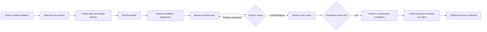

# School system design

## Purpose

A school or college owner creates an academy workspace, organizes teaching, and invites staff and students. Teachers publish homework, review submissions, and record results. Students see their classes, submit work, and receive feedback. The academy may later issue a completion credential after an authorized person approves it.

This document is the proposed product contract for a first build. The existing UI and Nostr notes in this folder are design references, not proof that those features exist.

## Terms

| Term | Meaning |
| --- | --- |
| Organization | A real school or college and its staff authority. |
| Academy | That organization's workspace in the app. One organization can start with one academy. |
| Subject | A reusable area of study, such as Mathematics or Biology. It has no roster or grades. |
| Class | One taught offering of a subject in a term, such as Biology 101, Term 1, Section A. Teachers, students, homework, and grades belong to a class. |
| Assignment | A task published to a class, with instructions, due date, submission rules, and an optional rubric. |
| Submission | A student's version of their work for an assignment. Versions remain in history. |
| Assessment | A teacher's feedback and score for a homework submission version or a recorded test result. |
| Completion | A decision that a student has met a class's published requirements. |
| Credential | An academy-signed record of completion that the student can choose to share. |

Use **class** in the interface; a college can label it **course** later without changing the underlying model. Keep subjects separate from classes so the same subject can run across terms and sections.

## Roles and authority

People have an account and receive roles within a particular academy. A person can be a student in one academy and a teacher in another. Teaching a class requires an explicit class assignment; being a teacher in the academy alone does not grant access to every class.

| Action | Owner / academy admin | Assigned teacher | Enrolled student |
| --- | --- | --- | --- |
| Create academy and set policies | Yes | No | No |
| Manage subjects, terms, classes, staff, and enrollment | Yes | View own classes | View own enrollment |
| Assign or remove a class teacher | Yes | No | No |
| Publish assignment for a class | Yes, if explicitly teaching that class; otherwise no | Yes | No |
| Submit or resubmit work | No | No | Own work only |
| Review, request revision, or grade | No, unless explicitly assigned as teacher | Assigned classes only | No |
| See an individual student's work or grade | Only when explicitly authorized for academic support or audit | Assigned classes only | Own records only |
| Set completion rules | Yes, before the class starts; changes require a recorded new version | Propose change | View rules |
| Recommend completion | No, unless assigned as teacher | Yes | No |
| Approve and sign credential | Only a separately authorized issuer | No | No |

An owner can administer the academy without automatically gaining issuer signing authority. Record who granted each role and when. Revoke access when someone leaves a class or the academy.

## Main workflow

### 1. Academy setup

1. Owner creates an academy with name, school/college type, time zone, and contact details.
2. Owner defines terms, subjects, default grading scale, late-work policy, and completion rules.
3. Owner invites teachers and students. An invitation is pending until the person accepts it; it grants no access before acceptance.
4. Owner creates a class from a subject, selects a term, and assigns one or more teachers.
5. Owner publishes the class after it has a teacher, dates, and visible policies, then enrolls students. Draft classes are invisible to students.

For an initial release, allow one academy per organization, manual invitations, and owner-managed enrollment. Bulk import and self-enrollment can follow after the basic flow works.

### Student enrollment

1. Owner adds a student to the academy and sends an invitation. The student accepts it and gains an academy membership.
2. Owner enrolls that student in a specific published class. Enrollment can be `pending`, `active`, `withdrawn`, or `completed`. Only `active` students can submit work.
3. Student sees the class in **My classes**, including teacher, schedule, assignments, and grading policy. The teacher sees the student on that class roster.
4. If the student withdraws, keep prior submissions and grades for authorized recordkeeping, but stop future class access according to academy policy. Record who changed enrollment and when.

A student joining the academy is **not** automatically enrolled in every class. Later, the academy can allow a student to request a class seat; the owner must approve before the enrollment becomes active.

### 2. Homework and submission

1. Assigned teacher opens one of their classes and creates a draft assignment with title, instructions, attachments, open date, due date, maximum score, and rubric or scoring guide.
2. Teacher selects the audience: the whole class by default, or named enrolled students when giving individual work. Show the recipient count before publishing.
3. Teacher previews the student view and publishes it. Only the selected students receive a class notification and see the due date in their dashboard. New enrollees receive existing class-wide assignments according to their enrollment date and the academy's catch-up policy.
4. Student submits text, files, or both. Show an explicit confirmation with the submitted version and time in the academy's time zone.
5. Student can replace a draft before submission. After submission, a change creates a new version. Keep the prior version and timestamp.
6. If the teacher requests a revision, include actionable feedback and a new deadline. Student resubmits against that request.
7. The late policy is visible before submission. Apply it consistently and flag exceptions for the teacher to explain.

Do not make a student's file or submission publicly readable. Peers can see each other's work only through a separate, opt-in class activity feature.

### Private visibility for coursework

| Item | Who can see it by default |
| --- | --- |
| Class name, schedule, teacher | Active class members and academy staff; a public catalog listing is a separate owner choice |
| Homework instructions | Assigned teacher, selected students, and authorized academy support staff |
| Student submission and files | That student, assigned teacher, and explicitly authorized academic staff |
| Teacher feedback and draft grade | Assigned teacher and explicitly authorized academic staff; student sees feedback only when released |
| Final grade | That student, assigned teacher, and explicitly authorized academic staff |
| Class roster | Assigned teacher and authorized academy staff; students do not see a roster by default |

Enforce these rules on file downloads, API responses, search, feeds, and notifications as well as on screens. A notification should say that homework or feedback is available and link to the protected page; it should not contain private grades or file contents. Individual homework must not appear to other students in the class.

### 3. Review, test scores, and grades

Treat **homework score** and **test score** as results of different assessment types; both belong in the class gradebook. A test may be recorded as a teacher-entered score in the first release. Online quizzes and automatic marking can be added later.

1. Teacher opens a review queue containing submitted and resubmitted work from assigned classes.
2. Teacher checks the latest version, enters rubric values or a numeric score, and writes feedback.
3. Teacher either requests a revision or saves a draft assessment. A draft is private to authorized staff.
4. Teacher finalizes the assessment. The student receives a notification and can view the score, feedback, rubric, and submission version that was graded.
5. A correction creates a new assessment revision with a reason and the previous result retained in the audit history. The current gradebook uses the latest valid revision.
6. The gradebook shows homework, tests, weighting, missing work, exemptions, and calculated total. Clearly distinguish `missing`, `not yet graded`, `excused`, and a scored zero.

The teacher may not silently overwrite a finalized result. A student can request a review of a grade; the academy sets a response window and an owner-designated academic reviewer resolves disputes. The reviewer needs explicit access to the relevant class and records.

### 4. Completion and credential

1. Class completion rules are published before students begin: required assignments, test requirements, minimum score, and any attendance requirement the academy actually tracks.
2. System computes eligibility from finalized results and shows the calculation to the assigned teacher. Teacher confirms or explains an exception.
3. Teacher sends a completion recommendation to an issuer queue. This does not issue a credential.
4. Authorized academy issuer verifies the student identity, class, rules, results, and teacher assignment. Issuer approves and signs, or declines with a reason.
5. Student receives the credential and can decide whether to share it. A correction or revocation produces a new status record and preserves the audit trail.

Credentials are a later milestone. The school can launch useful coursework and grading before building issuance.

## Status rules

| Record | States and allowed path |
| --- | --- |
| Invitation | `pending → accepted` or `pending → expired/revoked` |
| Class | `draft → published → archived`; archived classes remain readable to authorized members |
| Assignment | `draft → published → closed`; a published assignment's material changes create a revision and notify students |
| Submission | `draft → submitted → under review → revision requested → resubmitted` or `under review → graded` |
| Assessment | `draft → finalized → corrected`; correction links to the finalized assessment it replaces |
| Completion | `not eligible → eligible → recommended → approved/declined → issued` |

Every state change stores actor, time, reason when relevant, and record version. Prevent duplicate submission, grade, and issuance actions with idempotent commands. When a new submission arrives during review, warn the teacher and require review of the latest version before finalizing.

## Suggested data model

| Entity | Key relationships / fields |
| --- | --- |
| `Organization`, `Academy` | Owner, name, time zone, policies, issuer configuration |
| `Person`, `Membership` | Identity, academy role, invitation and access state |
| `Term`, `Subject`, `Class` | Class references one subject and one term; has dates and policy version |
| `TeacherAssignment`, `Enrollment` | Person-to-class links with start/end dates and state |
| `Assignment`, `AssignmentRecipient`, `RubricCriterion` | Class, author, selected audience, dates, max score, publication revision |
| `Submission`, `SubmissionVersion` | Student, assignment, text/file references, time, revision chain |
| `Assessment`, `AssessmentRevision` | Gradebook item, optional submission version, teacher, score, feedback, finalization and correction reason |
| `GradebookItem`, `GradePolicy` | Homework or test type, class, weight, scale, exemptions, calculation version |
| `CompletionRecommendation`, `Credential` | Student, class, evidence references, issuer decision, signed artifact/status |
| `AuditEvent`, `Notification` | Actor, action, affected record, time; recipient and delivery status |

Enforce academy and class boundaries on every server operation. Record IDs alone must never authorize access. Calculate grade totals on the server from a versioned grade policy, and display the calculation so students and staff can understand it.

## Nostr, identity, and privacy

The earlier design notes propose Nostr identities, signed events, and a social-style feed. Use those ideas with these boundaries:

- Keep rosters, student identity details, homework files, feedback, and scores in access-controlled storage. Do not publish them to public relays or place private content in a public event payload. This is especially important for minors.
- A social feed can show permitted activity summaries, but it is a view of authorized records, not the source of truth for private academic data.
- Nostr keys can identify people and sign selected actions. Decide key custody and recovery before requiring students, especially minors, to manage keys.
- Publish only information deliberately classified as public, such as an academy profile or a credential status record designed for public verification. A credential's detailed claims should be disclosed by the student or through a purpose-specific access grant.
- A valid signature proves which key signed an item; it does not by itself prove the school is trusted or that the academic claim is true. Issuer authorization and current status must be checked separately.
- Deleting local data does not erase copies already sent to other people or public relays. Privacy choices must be made before publication.

Before implementing credential sharing, specify what a grant reveals, who can receive it, how long it lasts, and what revocation can and cannot recall.

## Screens for the first release

| Role | Main screens | Primary action |
| --- | --- | --- |
| Owner | Academy setup, subjects, terms, classes, staff, enrollment, policy and audit views | Create and staff a class |
| Teacher | My classes, assignment editor, review queue, gradebook | Publish work and finalize feedback |
| Student | My classes, assignment detail, submission history, results | Submit work and read feedback |

Every role should see a dashboard with its next actions. Use clear status labels and notifications that deep-link to the relevant class, assignment, or submission. Make the core flows usable on phones and by keyboard.

## Build order and acceptance checks

1. **Academy and access:** Owner creates a workspace, term, subject, class, assigns a teacher, and enrolls a student. Verify that unrelated users cannot access that class.
2. **Assignment loop:** Teacher publishes homework; student submits; teacher requests revision; student resubmits. Verify version history and deadlines.
3. **Assessment:** Teacher finalizes a rubric score and a test score; student sees both; a correction retains the original result. Verify grade calculations and missing/excused distinctions.
4. **Completion:** System evaluates published criteria and a teacher recommends completion. Verify that a teacher cannot sign a credential.
5. **Credential pilot:** Authorized issuer approves and signs; student shares it; verifier checks signature, issuer authority, and status.

These are product slices, not a promise that the current repository implements them. Begin with the first three before adding a public social feed or automated quizzes.

## Decisions to settle before implementation

1. **Who can create an academy?** Open self-service, platform approval, or verified school onboarding. Recommend verified onboarding before issuing credentials.
2. **Who can enroll a student?** Owner only for the first release; decide whether teachers may request roster changes.
3. **How are minors handled?** Decide age rules, guardian involvement, record retention, consent, and local legal requirements before admitting minors.
4. **Which grading model applies?** Percentage, points, letter grades, and weighting vary by institution. Let an academy choose a versioned policy; do not assume one universal scale.
5. **What is a test?** Start with teacher-entered scores; define quiz delivery and anti-cheating requirements separately if needed.
6. **Who resolves grade disputes?** Designate an academic reviewer and a documented correction path.
7. **What is public on Nostr?** Approve an explicit field-level publication policy before any relay integration.
8. **Who controls the issuer key?** Define signing authority, key rotation, loss recovery, and revocation before issuing real credentials.
