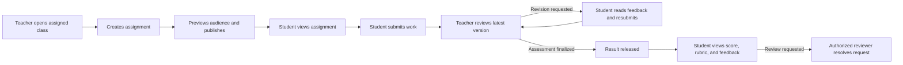

# User flows

Status: proposed product flows, September 2026. These flows describe the intended experience. Check
[build progress](architecture/progress.md) before treating a step as implemented.

This document turns the rules in [School system design](school-system.md) into role-by-role journeys.
The school system design remains the product contract if the documents differ.

## Core learning loop

The teacher works inside a **class**, not directly inside a subject. A subject is reusable catalog data;
the class connects that subject to a term, teachers, students, policies, assignments, and grades.



### Teacher creates and publishes an assignment

Preconditions: the teacher has an active academy membership, is assigned to a published class, and the
class has at least one active student.

1. Teacher opens **My classes** and selects a class. The class header shows its subject, term, section,
   roster count, grading policy, and teacher's access status.
2. Teacher opens **Assignments** and chooses **Create assignment**.
3. Teacher enters a title, instructions, open time, due time, maximum score, accepted submission type,
   and optional attachments and rubric.
4. Teacher selects the audience: all active students or named active students. The UI shows the exact
   recipient count and warns if there are no recipients.
5. Teacher chooses the late-work and resubmission rules allowed by the class policy.
6. Teacher saves a draft, previews the student view, and fixes validation errors. Drafts are invisible to
   students.
7. Teacher publishes after a confirmation summarizing class, audience, opening time, due time, and
   maximum score.
8. The system creates an audit event and notifies only the selected students. Notifications contain a
   protected link, not instructions, grades, or private files.
9. The assignment appears as **Scheduled** before its open time, **Open** while submissions are accepted,
   and **Closed** after it is manually closed or policy no longer permits submission.

After publication, a material edit creates a new assignment revision and notifies affected students.
Closing an assignment stops new submissions but does not delete existing work or assessments.

### Student submits work

Preconditions: the student has an active enrollment, is in the assignment audience, the assignment is
open, and the student is authenticated.

1. Student sees the task under **Dashboard → Due soon** or **My classes → Assignments**.
2. Student opens it and sees instructions, attachments, due time in the academy time zone, maximum
   score, rubric, submission rules, and late status.
3. Student enters text and/or attaches permitted files. Upload validation reports unsupported type,
   excessive size, or malware-scan failure without losing other draft work.
4. Student saves a private draft or chooses **Submit**.
5. Before submission, the UI summarizes the files/text, current time, and whether the work will be late.
6. Student confirms once. An idempotent command prevents a double click or retry from creating duplicate
   versions.
7. The system shows a receipt with version number and academy-local submission time. The teacher's review
   queue receives the submitted version.
8. If resubmission is allowed, the student may submit a new version. Prior submitted versions remain
   immutable and visible in history.

If enrollment is no longer active, the assignment is closed, or the deadline policy blocks late work,
the system refuses the submission and explains the applicable state. It must not silently save it as
submitted. A connection failure leaves recoverable draft content and offers a safe retry.

### Teacher reviews and records a result

1. Teacher opens **Review queue**, filtered to their assigned classes.
2. Teacher selects a submission. The UI shows the assignment revision, latest submitted version, earlier
   versions, timestamps, late state, and any previous revision request.
3. Teacher reviews the latest version and fills rubric values or a numeric score within `0..max score`,
   plus feedback.
4. Teacher chooses one outcome:
   - **Save draft:** visible only to authorized staff.
   - **Request revision:** requires actionable feedback and, when needed, a new deadline.
   - **Finalize result:** validates the rubric/score and identifies the exact submission version graded.
5. A revision request notifies the student and returns the work to their action list. Resubmission creates
   a new version and returns it to the review queue.
6. Finalization creates an immutable assessment revision, changes the submission to **Graded**, updates
   the gradebook, and releases a generic result-available notification.
7. If a newer submission arrives while the teacher is reviewing, the system blocks finalization until
   the teacher acknowledges and reviews the latest version.

### Student receives and reviews the result

1. Student opens the result from a notification, dashboard, or class gradebook.
2. Student sees score, maximum score, rubric breakdown, feedback, status, finalized time, and the exact
   submission version assessed.
3. The gradebook shows the effect on the class total and distinguishes **Not submitted**, **Submitted—not
   graded**, **Revision requested**, **Excused**, and a scored zero.
4. If academy policy permits, the student selects **Request grade review**, enters a reason, and receives a
   request receipt and expected response window.
5. The assigned teacher may explain the result. An owner-designated academic reviewer with explicit
   access resolves a formal dispute.
6. If a result is wrong, the teacher or authorized reviewer creates a correction with a reason. The
   student sees the corrected result; authorized history retains the replaced result.

## Academy and class setup flow

### Owner creates the teaching structure

1. Owner creates the academy and sets name, type, time zone, contact details, and privacy/retention rules.
2. Owner creates a term and reusable subjects.
3. Owner selects a subject and creates a class offering with section, dates, schedule, and a versioned
   grading/completion policy.
4. Owner assigns at least one active teacher. A teacher role alone does not grant access to every class.
5. Owner previews and publishes the class. An incomplete draft cannot be published.
6. Owner invites students to the academy, approves membership requests, and enrolls active members in the
   class.
7. Owner audits the roster and access grants before teaching begins.

### Class maintenance

1. Owner or authorized user edits safe metadata such as schedule or room.
2. A material policy change creates a new version with reason and effective time; the UI explains whether
   existing work is affected.
3. Removing a teacher ends future access but preserves authored records and audit history.
4. Withdrawing a student stops future class actions according to policy while retaining authorized school
   records.
5. Archiving a class makes it read-only for normal operations. Restore is explicit; deletion is blocked
   when dependent academic records exist.

## Invitation, membership, and enrollment flows

### Student joins an academy and class

1. Student opens a valid invitation, signs in, reviews academy identity and requested role, and chooses
   **Request membership**.
2. The request appears as **Pending** and grants no academy or class access.
3. Owner checks the request and approves or declines it. The student receives the decision.
4. Approval creates active academy membership; it does not enroll the student in every class.
5. Owner enrolls the student in a specific published class, or approves a class-seat request if that
   feature is enabled.
6. The class appears in **My classes** only when enrollment becomes active.

Expired, revoked, already-used, or wrong-account invitations show a clear recovery action. Repeating the
same request is idempotent. See [Membership and invitation flow](membership-flow.md) for record details.

### Teacher joins and is assigned

1. Teacher accepts an academy teacher invitation and gains an active academy-scoped teacher membership.
2. Owner assigns the teacher to one or more classes with effective dates.
3. Only those classes appear under **My classes**, and only their submissions enter the review queue.
4. When the assignment ends, access is removed while academic and audit records remain attributed to the
   teacher.

## Gradebook and test-score flows

### Teacher records a test result

1. Teacher opens a class gradebook and creates a **Test** item with name, date, maximum points, and weight.
2. Teacher enters a score, **Excused**, or **Missing** for each student; blank means not yet graded and is
   not converted to zero.
3. Teacher reviews calculated totals and saves a draft or finalizes results.
4. Finalized results become visible to each student separately. A student never sees another student's
   score.
5. Corrections require a reason and preserve the previous assessment revision.

### Teacher and student view totals

1. Teacher sees per-item status, totals, and calculation warnings for an assigned class.
2. Student sees only their items, weights, current total, and the policy version used.
3. Both can open a calculation explanation showing included, missing, and excused items.
4. A policy change recalculates only as defined by its effective version and remains reproducible later.

## Completion and credential flows

### Recommend class completion

1. The system evaluates each active enrollment against published completion rules using finalized results.
2. Teacher opens **Completion**, reviews the calculation and evidence, and resolves missing or ungraded
   work first.
3. Teacher confirms eligibility or records an allowed exception with a reason.
4. Teacher recommends completion. This sends a record to the issuer queue but does not issue or sign a
   credential.

### Approve, issue, and receive a credential

1. A separately authorized issuer reviews student identity, class, policy version, evidence snapshot, and
   teacher authority.
2. Issuer approves and signs, or declines with a reason. Duplicate approval is prevented.
3. Student receives the credential and can inspect its issuer, claims, issue time, and current status.
4. Student chooses whether and with whom to share it. Coursework, roster data, and per-item grades are not
   included in a public proof.
5. A verifier checks signature, issuer authority, subject, claim, and latest status.
6. Correction or revocation publishes a new status while preserving authorized history; the UI never
   presents a revoked credential as active.

## Notifications and dashboard flow

Each role's dashboard should answer **What needs my attention next?**

| Role | Action groups |
| --- | --- |
| Owner | Membership requests, roster changes, unstaffed draft classes, policy decisions, issuer queue if separately authorized |
| Teacher | Assignments to publish, submissions to review, revisions returned, ungraded tests, eligible completions |
| Student | Invitations, upcoming/open assignments, revision requests, released results, completion or credential updates |

Notifications are deduplicated, have read/unread state, and deep-link to an authorized record. If access
has since been revoked, the destination explains that access changed without revealing private content.
Email, push, and relay delivery are transports; the in-app record remains the source of truth.

### Task and notification event contract

A domain action can create both an **action task** and a **notification**:

- An action task is a durable inbox item such as **Accept teacher invitation** or **Review submission**.
  It remains open until completed, dismissed when allowed, or made obsolete by a later state change.
- A notification announces that something changed. It can be read without completing the related task.
- A mobile/browser push is only a delivery copy of the notification. It is not the academic record and
  must not contain private homework text, files, feedback, scores, student legal names, or roster data.

Create the domain change, audit event, action task, notification, and outbox entry in one transaction.
Deliver push after commit. Retrying delivery must not duplicate the task or domain action.

| Event key | Trigger | Task recipient | Notification recipients | Resulting action |
| --- | --- | --- | --- | --- |
| `teacher.invited` | Owner sends a teacher invitation | Invited teacher | Invited teacher; inviting owner gets delivery status | Teacher reviews and accepts or declines the invitation |
| `teacher.invitation.accepted` | Teacher accepts | Owner | Owner and teacher | Owner assigns the teacher to a class |
| `teacher.assigned` | Owner assigns an active teacher to a class | Teacher | Teacher and owner | Teacher opens the class and reviews its policy and roster |
| `student.membership.requested` | Student requests academy membership | Owner/enrollment administrator | Owner/enrollment administrator; student gets pending confirmation | Review membership request |
| `student.enrollment.requested` | Student requests a class seat | Owner/enrollment administrator | Owner/enrollment administrator; student gets pending confirmation | Approve or decline enrollment |
| `assignment.published` | Teacher publishes to an audience | Selected students | Selected students; publishing teacher gets confirmation | Student opens the assignment |
| `submission.received` | Student submits a new version | Assigned teacher(s) | Assigned teacher(s); student gets receipt | Review the latest submission version |
| `submission.revision_requested` | Teacher requests revision | Student | Student and requesting teacher | Student reads feedback and resubmits |
| `submission.resubmitted` | Student responds to revision | Assigned teacher(s) | Assigned teacher(s); student gets receipt | Review the new version |
| `assessment.finalized` | Teacher finalizes a result | Student | Student; teacher gets confirmation | Student views the released result |
| `grade.review_requested` | Student disputes a released result | Assigned teacher and designated reviewer | Those reviewers; student gets receipt | Respond within the academy review window |
| `assessment.corrected` | Authorized teacher/reviewer corrects a result | Student | Student and relevant teacher/reviewer | Student views the corrected result |
| `completion.eligible` | Finalized results first satisfy the rules | Assigned teacher | Assigned teacher | Review and recommend completion |
| `completion.recommended` | Teacher recommends completion | Authorized issuer | Issuer and recommending teacher | Approve or decline issuance |
| `credential.issued` | Issuer signs the credential | Student | Student and issuer | Student reviews or shares the credential |
| `credential.revoked` | Authorized issuer revokes it | Student | Student, issuer, and active share-status subscribers | Stop presenting the credential as active |

The owner is **not** automatically notified about each student's submission or given access to it.
Owners may receive non-identifying operational summaries such as “3 submissions await review in
Biology 101.” An owner receives student-level submission events only when they also hold an explicit,
audited academic-support permission for that class.

### Example: invite a teacher

1. Owner enters the teacher's delivery address or account identifier, chooses **Teacher**, and sends the
   invitation.
2. The system records `teacher.invited`, creates one pending task for the invited teacher, and queues push
   delivery after the invitation transaction commits.
3. Safe push text: **“BitOS Academy invited you to join as a teacher.”** The push opens the protected
   invitation screen. It does not grant access.
4. Teacher signs in using the intended account and accepts or declines.
5. Acceptance records `teacher.invitation.accepted`, closes the teacher's invitation task, and creates an
   owner task to assign the teacher to a class.
6. After class assignment, the teacher receives `teacher.assigned` with academy, subject, class, term,
   section, and start date context.

### Example: student submits homework

1. A successful submission transaction records the immutable submission version and
   `submission.received` event.
2. The system creates or refreshes one **Review submission** task for every currently assigned teacher.
   Multiple submission versions update the task to the latest version instead of creating a confusing
   stack of duplicate open tasks.
3. Safe push text: **“New homework submission in Biology 101: Cell Structure.”** Student identity may be
   shown only on an authenticated device when academy policy permits lock-screen identity disclosure;
   the recommended default omits it.
4. The push deep-links to the protected review screen. After authorization, the screen may load the
   student, subject, class, assignment, submission version, submitted time, and late state.
5. The student receives a separate submission receipt. The academy owner receives no student-level event
   by default; their dashboard may show an aggregate count.
6. When any assigned teacher finalizes a result or requests revision, the shared review task closes for
   the other teachers so the same version is not reviewed twice. Concurrent actions use record-version
   checks.

### Event data and push-safe data

The protected event record may reference private objects; the external push payload must be minimal.

| Field | Protected event/task | External push payload |
| --- | --- | --- |
| `event_id`, `event_key`, `occurred_at` | Yes | Opaque notification ID and generic type only |
| `academy_id` | Yes | Omit or use opaque routing ID |
| `subject_id`, `class_id`, `assignment_id` | Yes | Opaque deep-link route; human-readable class/assignment title only if policy allows |
| `submission_id`, `submission_version` | Yes | Omit from visible text; opaque route may resolve it after authorization |
| Actor/student identifier | Authorized recipients only | Omit by default, especially from lock-screen text |
| Homework text, files, feedback, rubric, score | Loaded separately after authorization | Never |
| `recipient_id`, delivery channels, delivery state | Yes | Provider-specific opaque target only |

Suggested protected event shape:

```json
{
  "event_key": "submission.received",
  "actor_id": "person_student",
  "academy_id": "academy_123",
  "subject_id": "subject_biology",
  "class_id": "class_bio_101_a",
  "assignment_id": "assignment_cell_structure",
  "submission_id": "submission_456",
  "submission_version": 2,
  "occurred_at": "2026-09-29T08:30:00Z"
}
```

This is a private application/outbox event, not a public Nostr event. Coursework notification data must
not be published to public relays. A Nostr-based private transport, if piloted, still follows the
metadata and retention warnings in [Nostr event strategy](architecture/nostr-events.md).

## Cross-cutting alternate flows

| Situation | Expected behavior |
| --- | --- |
| Empty class | Teacher may draft work but cannot publish to zero recipients without an explicit warning and product-approved override. |
| Student added after publication | Apply the class catch-up policy; show whether earlier class-wide assignments were assigned and notify the student. |
| Assignment materially edited | Create a revision, retain the prior version, recalculate affected dates if permitted, and notify recipients. |
| Deadline passes during editing | Re-evaluate policy on submit; preserve draft and explain late or closed status. |
| Duplicate click or network retry | Return the original successful result using the idempotency key. |
| New version during review | Warn and block finalization against an unknowingly stale version. |
| File scan pending | Keep the file unavailable and show processing state; never let a pending or failed scan bypass download controls. |
| User loses access | Deny UI, API, search, notification, and file access consistently; retain records according to policy. |
| Teacher unavailable | Owner assigns a replacement teacher; access and the handover are audited. |
| Score outside range or incomplete rubric | Block finalization and identify the fields to fix. |
| Grade correction | Require a reason, retain the old result, recalculate totals, and notify the student. |
| No connection | Preserve safe local draft input where possible; do not claim publish, submit, or grade succeeded until confirmed. |
| Concurrent edit | Compare expected record version, reject stale writes, and offer refresh/reapply instead of silent overwrite. |
| Unauthorized guessed link or ID | Return a non-disclosing not-found/forbidden response and never expose names, existence, or files. |

## End-to-end acceptance journeys

1. **Happy path:** owner creates subject and class, assigns teacher, enrolls student; teacher publishes an
   assignment; student submits; teacher finalizes a score; only that student sees the result.
2. **Revision path:** teacher requests revision with a new deadline; student resubmits; teacher grades the
   new version; both versions remain in authorized history.
3. **Late path:** student sees the late policy before submitting; the system labels the submission late and
   applies or records the configured consequence consistently.
4. **Correction path:** a finalized grade is corrected with a reason; the current total changes and the
   earlier assessment remains auditable.
5. **Privacy path:** another student cannot discover the assignment when not targeted, submission, score,
   private file, roster entry, notification content, or guessed API resource.
6. **Completion path:** finalized grades meet the published rule; teacher recommends completion; only an
   authorized issuer signs; student receives and optionally shares the credential.
7. **Revoked-access path:** a withdrawn student and removed teacher lose future access across screens,
   APIs, search, downloads, and notification links without destroying required history.

## Product decisions still required

These flows depend on policy choices that must be settled before the affected feature ships:

- allowed submission file types, size limits, virus scanning, and retention;
- whether students may submit late or resubmit without a teacher request;
- what happens to class-wide assignments for students enrolled later;
- who may grant academic support access and resolve grade disputes;
- whether notifications use email/push in addition to the in-app inbox;
- age, guardian consent, privacy, export, and deletion rules for minors;
- credential format, disclosure fields, issuer-key custody, recovery, and revocation.
